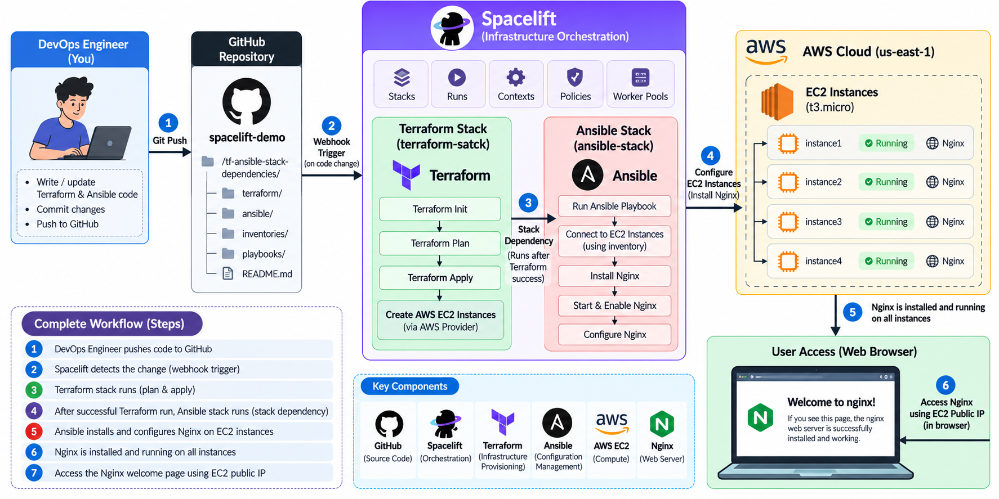
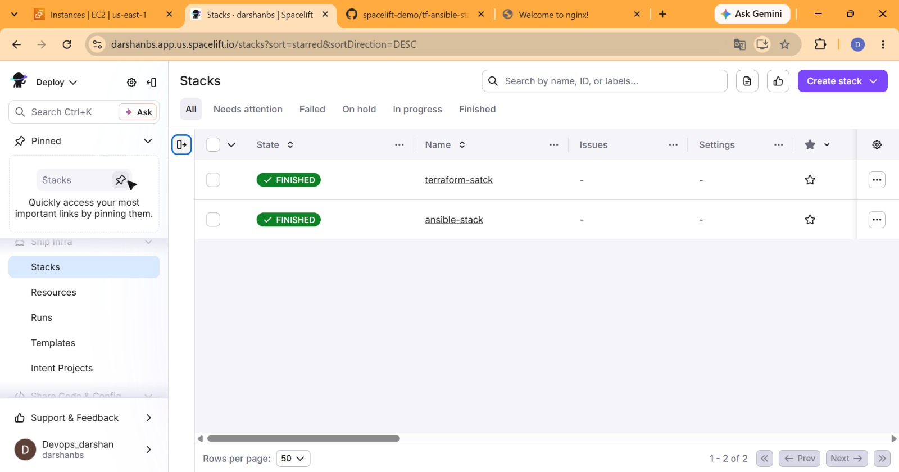
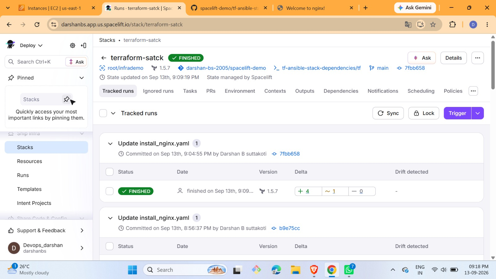
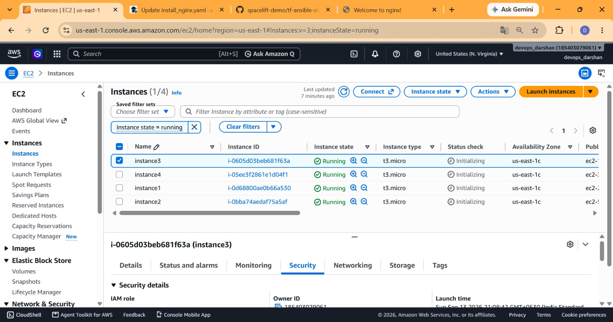

# Spacelift Demo: Terraform + Ansible with Stack Dependencies

This project shows how to use **Spacelift** to build servers on AWS with **Terraform** and then set them up with **Ansible**, all in one automatic pipeline.

- **Terraform** creates 4 EC2 servers on AWS.
- **Ansible** logs in to those servers and installs **Nginx** (a web server).
- **Spacelift** connects the two, so Ansible only runs after Terraform has finished.


---

## Table of Contents

1. [What is Spacelift?](#1-what-is-spacelift)
2. [Main Spacelift objects (concepts)](#2-main-spacelift-objects-concepts)
3. [About this project](#3-about-this-project)
4. [Project structure](#4-project-structure)
5. [How it works (step by step)](#5-how-it-works-step-by-step)
6. [Prerequisites](#6-prerequisites)
7. [How to set it up](#7-how-to-set-it-up)
8. [How to check that it worked](#8-how-to-check-that-it-worked)
9. [What I saw when I ran it](#9-what-i-saw-when-i-ran-it)
10. [Clean up (avoid AWS charges)](#10-clean-up-avoid-aws-charges)
11. [Troubleshooting](#11-troubleshooting)
12. [What I learned](#12-what-i-learned)
13. [Useful links](#13-useful-links)

---

## 1. What is Spacelift?

Spacelift is an **infrastructure automation platform**. It helps teams manage their cloud infrastructure in a safe and organized way.

Think of it like a **smart CI/CD tool made only for infrastructure**. Normally you run `terraform apply` on your own laptop. With Spacelift, you push code to GitHub, and Spacelift runs the commands for you, shows you the plan, and keeps a history of everything.

Spacelift works with many tools:

- Terraform and OpenTofu
- Ansible
- Pulumi
- AWS CloudFormation
- Kubernetes
- Terragrunt

> Note: In the official docs, the main product is now called **Spacelift Deploy** (the name changed when *Spacelift Flows* was added). In this README, I just say "Spacelift".

### Why use Spacelift?

| Problem without Spacelift | How Spacelift helps |
| --- | --- |
| Everyone runs Terraform from their own laptop | Everything runs in one central place |
| Hard to know who changed what | Every change is linked to a Git commit and a run |
| Cloud passwords stored on laptops | Cloud access is managed safely in Spacelift |
| No review before changes | Preview changes on pull requests before merging |
| Different tools run separately | Link tools together (for example Terraform, then Ansible) |

---

## 2. Main Spacelift objects (concepts)

These are the building blocks of Spacelift. You will meet most of them in this project.

### Stack
A **stack** is the **most important object** in Spacelift. A stack connects:

- one **Git repository** (your code),
- one **branch** (for example `main`),
- one **folder** inside the repo (the "project root"),
- one **tool** (Terraform, Ansible, and so on),
- your **cloud account** (like AWS).

Stacks also keep track of the **state** of your infrastructure. In this project we have **two stacks**: one for Terraform and one for Ansible.

### Run
A **run** is one job that Spacelift performs on a stack. There are three main kinds:

- **Tracked run**: A real deployment. It starts from a new commit on the tracked branch and can change real infrastructure. (In this project, the runs you see on the stack page are tracked runs.)
- **Proposed run**: A preview. It runs on pull requests and shows what *would* change, without changing anything.
- **Task**: A one-time command you run by hand on a stack (for example, a custom shell command).

### Stack dependencies
You can make one stack **depend on another**. When the first stack finishes successfully, the second one starts automatically. You can even pass **outputs** from the first stack as **inputs** to the second one. **This is the key feature used in this project.**

### State management
Terraform keeps a **state file**, which remembers what it has built. Spacelift can store and manage this state for you (this project uses **"State managed by Spacelift"**), or you can use your own backend like S3.

### Worker pools
A **worker** is the machine that actually runs your jobs. Workers are grouped into **worker pools**. There are:

- **Public worker pools**: managed by Spacelift (easiest, used for this demo).
- **Private worker pools**: hosted by you, for extra control and security.

### Cloud integrations
Spacelift can connect to **AWS, Azure, and Google Cloud**. This lets stacks get temporary cloud access without you pasting passwords into your code.

### Source control integration (VCS)
Spacelift connects to **GitHub, GitLab, Bitbucket, Azure DevOps**, and others. When you push or open a pull request, Spacelift reacts to it.

### Environment (variables)
Settings and secrets (like environment variables and mounted files) that a stack uses when it runs. Secrets can be hidden (write-only).

### Context
A **context** is a **reusable bundle of environment variables and files** that you can attach to many stacks. Change it once and every stack gets the update.

### Runtime configuration
A file named `.spacelift/config.yml` in your repo where you can set things like the Terraform version, extra commands before or after a run, and more.

### Policies
**Policies** are **rules written as code** (using the Open Policy Agent language called *Rego*). Spacelift has different types:

| Policy | What it decides |
| --- | --- |
| Login policy | Who can log in |
| Access policy | Who can see or change a stack |
| Approval policy | Who must approve a run before it goes ahead |
| Plan policy | Is this Terraform plan allowed? (for example, "no untagged buckets") |
| Push policy | What should happen when someone pushes code |
| Trigger policy | Which other stacks should start after a run |
| Notification policy | Who gets notified, and how |

### Spaces
A **space** is a folder-like way to organize stacks, policies, contexts, and so on, and to control **who can access what**. Spaces can be placed inside other spaces (like a tree).

### Resources
The view that shows the **cloud resources** that your stacks manage (for example, EC2 instances).

### Blueprints and Templates
- **Blueprint**: A ready-made recipe to create **new stacks** quickly.
- **Template**: A reusable setup that teams can deploy again and again.

### Drift detection
**Drift** means the real cloud is different from what your code says (for example, someone changed a server by hand). Spacelift can check for this regularly.

### Scheduling
Run actions at set times, like a nightly drift check or a delayed deployment.

### Notifications and Webhooks
Get alerts (for example in Slack or Microsoft Teams) or send events to your own web address when something happens.

### Module and Provider registry
A private place to store and share your own **Terraform modules and providers**.

### spacectl
`spacectl` is the **Spacelift command line tool**. You can use it to control Spacelift from your terminal.

### Spacelift Intelligence and Flows
- **Spacelift Intelligence**: AI features such as *Infra Assistant* (a chat helper) and *Intent*.
- **Spacelift Flows**: A separate product for building automation workflows.

> Learn more in the official docs: https://docs.spacelift.io/

---

## 3. About this project

### The goal
Show how to **chain two tools** using Spacelift stack dependencies:

1. **Terraform** builds the infrastructure (EC2 servers).
2. **Ansible** configures those servers (installs Nginx).

### What gets created

| Item | Details |
| --- | --- |
| Cloud | AWS |
| Region | `us-east-1` (N. Virginia) |
| Servers | 4 EC2 instances: `instance1`, `instance2`, `instance3`, `instance4` |
| Instance type | `t3.micro` |
| Software installed | Nginx web server (installed by Ansible) |

### The two Spacelift stacks

| Stack name | Tool | Job |
| --- | --- | --- |
| `terraform-satck` | Terraform (version 1.5.7) | Creates the 4 EC2 instances |
| `ansible-stack` | Ansible | Installs Nginx on the instances using `install_nginx.yaml` |

> The name `terraform-satck` has a small spelling mistake ("satck"). I kept it as it appears in my Spacelift account so that this README matches what you see on screen. You can name yours `terraform-stack`.

### Stack settings used for the Terraform stack

- **Repository:** `darshan-bs-2005/spacelift-demo`
- **Project root:** `tf-ansible-stack-dependencies/tf`
- **Branch:** `main`
- **State:** managed by Spacelift

---

## 4. Project structure

```text
spacelift-demo/
├── .gitignore
├── LICENSE
├── README.md                          <- this file
└── tf-ansible-stack-dependencies/
    ├── tf/                            <- Terraform code (creates EC2 instances)
    └── ansible/                       <- Ansible code (install_nginx.yaml)
```

> Please check the folder names inside `tf-ansible-stack-dependencies/` and update this tree if your file names are different (for example the exact Terraform and Ansible file names).

---

## 5. How it works (step by step)

### Project diagram

This diagram shows the full flow: from pushing code to GitHub, through the two Spacelift stacks, to Nginx running on the AWS EC2 instances.



### The flow in text

```text
  You push code to GitHub
            |
            v
  Spacelift sees the new commit
            |
            v
  [Stack 1] terraform-satck
     - terraform plan
     - terraform apply
     - Creates 4 EC2 instances on AWS
            |
            |  (stack dependency: wait for success)
            v
  [Stack 2] ansible-stack
     - Reads the server details from Terraform
     - Runs install_nginx.yaml
     - Installs Nginx on all 4 servers
            |
            v
  Open the server's public IP in a browser
  and see "Welcome to nginx!"
```

In plain words:

1. You change the code and **commit** it to GitHub.
2. Spacelift starts a **tracked run** on the Terraform stack.
3. Terraform **plans** (shows what will change) and then **applies** (builds the servers).
4. When the Terraform stack is **FINISHED**, Spacelift automatically triggers the Ansible stack because of the **stack dependency**.
5. Ansible connects to the new servers and **installs Nginx**.
6. The servers now serve the default Nginx web page.

---

## 6. Prerequisites

Before you start, you need:

- A **GitHub account** (to fork or clone this repo).
- A **Spacelift account** (a free trial is available at https://spacelift.io).
- An **AWS account** with permission to create EC2 instances.
- An **SSH key pair** in AWS (Ansible needs this to log in to the servers).
- Basic knowledge of Git. Knowing Terraform and Ansible helps, but is not required.

> **Cost warning:** EC2 instances can cost money. `t3.micro` is cheap, but always delete resources when you are done (see [Clean up](#10-clean-up-avoid-aws-charges)).

---

## 7. How to set it up

### Step 1: Get the code

```bash
git clone https://github.com/darshan-bs-2005/spacelift-demo.git
cd spacelift-demo
```

### Step 2: Connect GitHub to Spacelift

1. Log in to Spacelift.
2. Make sure your GitHub account (or organization) is connected as the source code provider.
3. Give Spacelift access to the `spacelift-demo` repository.

### Step 3: Connect AWS to Spacelift

1. In Spacelift, go to the **cloud integrations** settings and add an **AWS integration**.
2. Create an **IAM role** in AWS that Spacelift is allowed to use.
3. Attach the integration to your Terraform stack so it can create EC2 instances.

(Follow the official guide: https://docs.spacelift.io/integrations/cloud-providers/aws)

### Step 4: Create the Terraform stack

1. Click **Create stack**.
2. Fill in the details:
   - **Name:** `terraform-satck` (or `terraform-stack`)
   - **Repository:** `spacelift-demo`
   - **Branch:** `main`
   - **Project root:** `tf-ansible-stack-dependencies/tf`
   - **Backend:** Terraform, with state managed by Spacelift
   - **Terraform version:** `1.5.7`
3. Attach your **AWS integration**.
4. Save the stack.

### Step 5: Create the Ansible stack

1. Click **Create stack** again.
2. Fill in the details:
   - **Name:** `ansible-stack`
   - **Repository:** `spacelift-demo`
   - **Branch:** `main`
   - **Project root:** the folder that has the Ansible playbook
   - **Backend:** Ansible
   - **Playbook:** `install_nginx.yaml`
3. Add the **SSH private key** as a secret (environment variable or mounted file) so Ansible can log in to the servers.
4. Save the stack.

### Step 6: Add the stack dependency

1. Open the **`ansible-stack`**.
2. Go to the **Dependencies** tab.
3. Add **`terraform-satck`** as the stack it depends on.
4. (Optional) Map Terraform **outputs** (like server IP addresses) to Ansible **inputs**.

Now Ansible will always wait for Terraform to finish first.

### Step 7: Run it

1. Open the Terraform stack.
2. Click **Trigger** to start a run (or just push a new commit).
3. Watch the plan, then confirm the apply if Spacelift asks.
4. When Terraform finishes, watch the Ansible stack start by itself.

---

## 8. How to check that it worked

1. **In Spacelift:** Both stacks should show a green **FINISHED** badge on the **Stacks** page.
2. **In AWS:** Open **EC2 > Instances**. You should see 4 instances in the `Running` state.
3. **In your browser:** Copy the **public IP** of one instance and open `http://<public-ip>`. You should see:

   ```text
   Welcome to nginx!
   ```

> If the page does not open, check that the **security group** allows inbound traffic on **port 80 (HTTP)**.

---

## 9. What I saw when I ran it

### Screenshot 1: Spacelift Stacks page

Two stacks, `terraform-satck` and `ansible-stack`, both in the **FINISHED** state.



### Screenshot 2: Terraform stack and its tracked runs

The stack used Terraform `1.5.7` from the `main` branch. Tracked runs came from commits named **"Update install_nginx.yaml"**. A run showed `+4` (4 resources added), `~1` (1 changed) and `-0` (none destroyed). The 4 added resources are the EC2 instances.



### Screenshot 3: AWS EC2 instances

4 `t3.micro` instances (`instance1` to `instance4`) in `us-east-1c`, all in the **Running** state. At first the status check showed *Initializing*, which is normal for a new server. It turns into *2/2 checks passed* after a few minutes.



### Browser result

The default **"Welcome to nginx!"** page opened, proving Ansible installed Nginx.

---

## 10. Clean up (avoid AWS charges)

When you are finished, destroy the servers so you are not charged.

1. Open the **`terraform-satck`** in Spacelift.
2. Create a **Task** and run:

   ```bash
   terraform destroy -auto-approve
   ```

3. Check **EC2 > Instances** in AWS to make sure all 4 instances are terminated.
4. (Optional) Delete both stacks from Spacelift.

---

## 11. Troubleshooting

| Problem | What to try |
| --- | --- |
| Terraform run fails with AWS permission errors | Check that the AWS integration is attached to the stack and the IAM role has EC2 permissions |
| Ansible says "unreachable" or "permission denied" | Check the SSH key, the username (for example `ubuntu` or `ec2-user`), and that port 22 is open in the security group |
| Ansible stack does not start after Terraform | Check the **Dependencies** tab on the Ansible stack |
| Nginx page does not open | Check that port 80 is open in the security group and that you used the **public** IP |
| Instance status stuck on "Initializing" | Wait 2 to 5 minutes and refresh |
| Wrong or old Terraform version | Set the Terraform version in the stack settings |

---

## 12. What I learned

- What Spacelift is and how stacks, runs, and policies work.
- How to run Terraform from Spacelift instead of my laptop.
- How **stack dependencies** link Terraform and Ansible together.
- How to read a run's summary (`+` added, `~` changed, `-` destroyed).
- Why it is important to destroy test infrastructure when finished.

---

## 13. Useful links

- Spacelift docs: https://docs.spacelift.io/
- Spacelift stacks: https://docs.spacelift.io/concepts/stack
- Stack dependencies: https://docs.spacelift.io/concepts/stack/stack-dependencies
- Spacelift with Ansible: https://docs.spacelift.io/vendors/ansible
- Terraform docs: https://developer.hashicorp.com/terraform/docs
- Ansible docs: https://docs.ansible.com/
- Original demo repo: https://github.com/iam-veeramalla/spacelift-demo

---

## License

This project uses the license in the [LICENSE](LICENSE) file.

